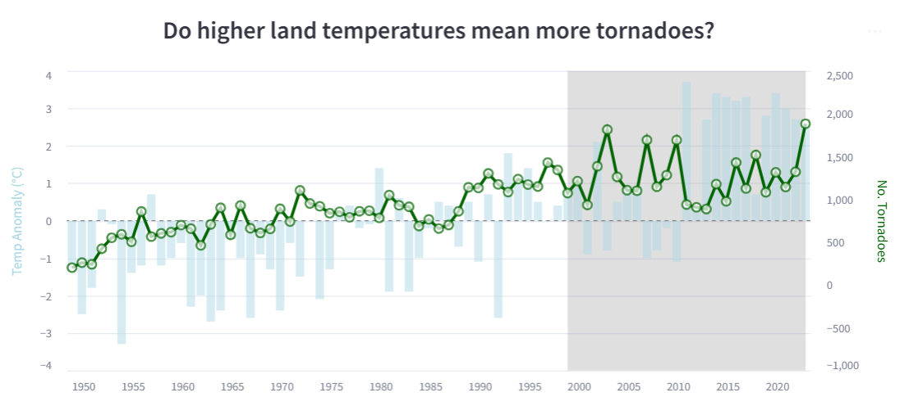

# 🌀 Tornado Tracker Dashboard

Explore how tornado patterns and climate change have evolved across the United States over the past decades.  
Built with **Streamlit** and **Altair**, this dashboard offers interactive visualizations across multiple dimensions: location, time, intensity, and environmental factors.

🔗 [Live App Link](https://si649-narrative-project.streamlit.app/)

---

## 🌟 Project Preview

### Interactive Tornado Tracker

|  |  |  |
|:---:|:---:|:---:|
|  |  |  |
| *Top Storm Events for Injuries, Deaths, and Damage (U.S., 2024)* | *U.S. Tornado Distribution by State* | *Monthly Tornado Frequency and Intensity Trends* |

|  |  |  |
|:---:|:---:|:---:|
|  |  |  |
| *Tornado Size Distribution: Length vs Width Across All States* | *Tornado Timing and Impact Heatmap* | *Climate Change and Tornado Trends (1950–2024)* |

---

## 📊 Features

**2024 State Analysis View**  
Explore tornado counts and intensities across all U.S. states in 2024.  
- Interactive U.S. map by tornado frequency
- Monthly trends in tornado occurrence and intensity
- Tornado size scatterplots (length vs width)
- Distribution of tornadoes by Enhanced Fujita (EF) scale

**Multi-Year Heatmap View (2000–2024)**  
Analyze broader tornado patterns across hours, months, and years.  
- Customize heatmap by different metrics: number of tornadoes, injuries, deaths, property damage, crop damage
- Explore seasonal and hourly tornado patterns
- Zoom in on specific timeframes using dynamic filters

**Climate Change Insights**  
Investigate how rising land surface temperatures correlate with tornado activity from 1950 to 2024.  
- Dual-axis chart: land temperature anomaly vs tornado counts
- Observes positive correlation between temperature rise and tornado reports

---
